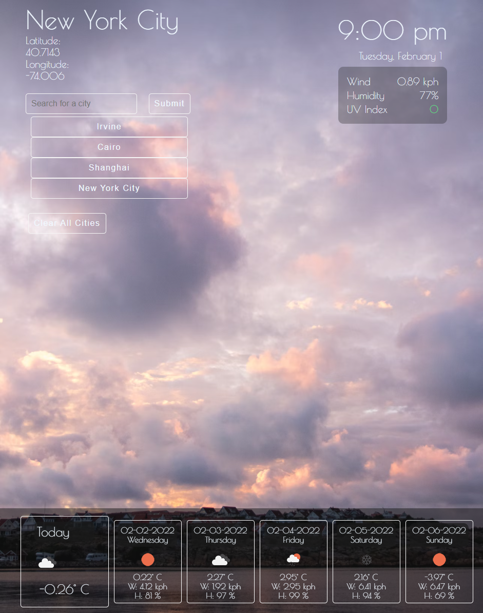

# Weather-Forecast-App

## About

This weather app will show the current weather of the selected location.  This includes humidity, UV index, wind speed and temperature, along with an icon showing the day's weather.
At the bottom of the app are cards showing the forecast of the next 5 days and thier respective humidity, wind speed and temperature. The cards at the bottom are scrollable at small screen sizes. Additionally, the user can enter a city name to display the aforementioned information for that city. All the cities entered by the user are saved and can be clicked to quickly switch to the weather data for that city.

Access the weather app at :
https://famesmyname.github.io/Weather-Forecast-App/

## Instructions

This is the screenshot of the UI.

- At the top left is the current city and its coordinates. 
- Below the city name, the user can enter a city in the input box and submit to change the current city.
- Any of the saved cities can be click to quickly switch to that city. 
- Press the clear cities button to clear the storage.

- The top left shows the current day's weather data including: humidity, wind speed, and UV index along with idicators for the severity of UV.
- UV severity is as follows; 0 - 2 is good and is shown as green, 2 - 6 is medium severity and is shown as yellow, any UV index higher than 6 is considered severe and shown as red.

- At the bottom of the page are the temperatures for today and the next 5 days along with the humidity and wind speed for the next 5 days at the current city.

## Credits
- unsplash.com for the use of an image as the background for the app

## Version History

1.00     -Release Version

1.01    - Fixed bug where the day 5 date was showing incorrectly
        - Fixed sizing of buttons to provide better functionality at smaller screen sizes.